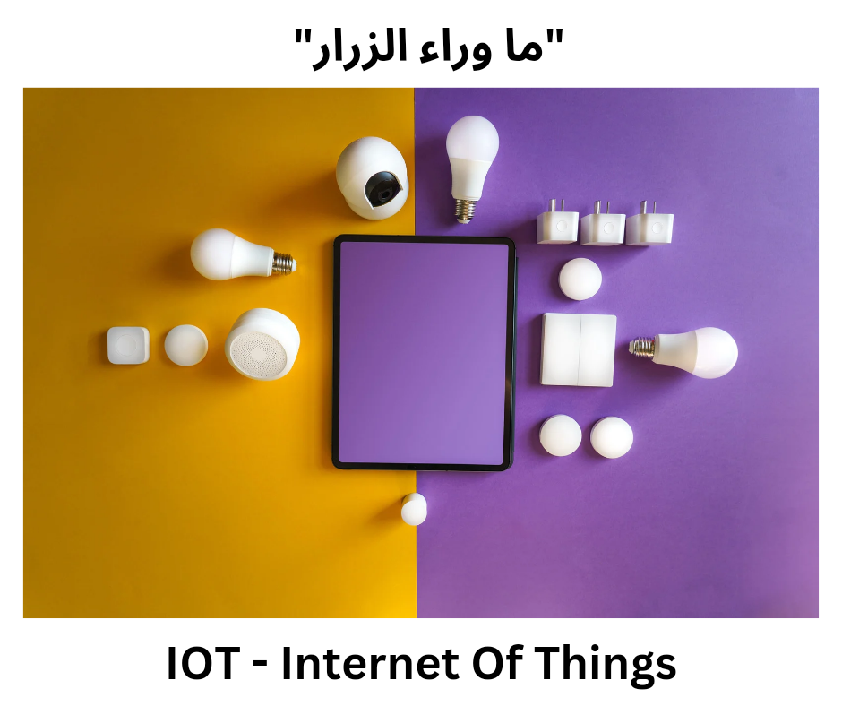

# ما هو انترنت الاشياء؟ (IOT)

{ width=500 }

## السلام عليكم ورحمه الله وبركاته، اهلا بيكم في اول بوست من "ما وراء الزرار".

النهاردة موضوعنا عن "انترنت الأشياء -IOT"، او ما القبه شخصياً بـ "سحر التكنولوجيا".
بالمناسبة، انت بتستخدمها في اجزاء كتير من حياتك

<!-- more -->

الموضوع النهاردة بسيط قدر المستطاع، وهنتدرج في رفع مستوى الصعوبة بالتدريج في الصعوبة.
متخافش يا صديقي، مفيش مصطلح مش هشرحه وهتلاقي مرجع لطيف في اخر المقال.

## خلينا نرجع لورا شويه، مع دخول عصر الانترنت لمصر.

عصر Skype و yahoo وبنكلم قرايبنا video call وبنضحك.
كان عندنا وقتها احلام كتيرة جدا، زي العربيات الطائرة، والـ Robots والنهضة التكنولوجية.
في الوقت ده كان عندنا مشكلة كبيرة جدا، انا مش قادر اتحكم بالأجهزة بتاعتي.
انا مش قادر اخليها تخدمني وتنفذ اللي انا محتاجه، وتعمل شويه حاجات روتينية بالنيابة عني.
لسه موصلناش للمرحلة اللي نقدر نقول عندها إن أخيراً بقى عندنا روتين نقدر نحط فيه الجهاز بتاعنا وهو يديره بشكل تلقائي وعملي جدا.

## لحد ما ظهر السحر، وانضم لينا في الكوكب الجميل ده الـ IOT اختصاراً لـ "Internet Of Things".

وعلشان نفهم المصطلح ده قد ايه كبير ودقيق فعلاً وايه فكرته، هنرجع تاني للحاضر.
الوقت اللي فيه الـ Smart home وبمجرد ما بتعدي او بتقرب من البيت بيحصل حاجه معينه،
الوقت اللي بتقدر تدي اوامر لمختلف الأجهزة بأنواعها؛
والوقت اللي بتقدر فيه أخيراً الأجهزة تاخد قرار بنائا على حدث معين.

التطور ده كان لا يمكن يحصل من غير إن الاجهزة ديه تبتدي تكلم بعض، وتوصف حاجات من العالم الحقيقي.
من السياق ده، اول حاجه محتاجين انها تحصل إن الجهاز يبتدي يحس ويشوف.
على الاقل مش بنفس الطريقة اللي بنحس بيها.
ومن هنا جه مصطلح مستشعر "Sensor".

لنفترض مثلا عايز تحس برطوبه التربة وبمجرد ما يحصل حدث معين تشغل اجهزة الرش مثلاً، بقى ممكن تعمل ده واكتر، زي انك تاخد تنبيه عن مثلا لو فيه مرض معين في النبات.

## طب ياعم ماشي هو خد الداتا او الحالة المحيطة، هيوصلها ازاي للجهاز التاني زي جهاز الرش مثلا؟

هنا الموضوع بيكبر وبيدخل في إن الاجهزة بتكلم بعض، ومن هنا جت التسمية iot.

تفتكر الموضوع واقف على كده؟
نهائي، والتطور في الجزء ده تحديداً مش واقف على شويه مية بتطلع من مرش او لمبة.
الموضوع بيكبر وبيدخل في الروبوتس والذكاء الاصطناعي، وهنتكلم عنهم قريب.

هتلاقي هنا في موقع "المتخلفين للمتخلفين" او زي ما بيسموا نفسهم "المهووسين للمهووسين" شويه مقالات عن الموضوع ده هتفيدك جدا: [IOT - GeeksForGeeks](https://www.geeksforgeeks.org/tag/iot/)

كان معكم احمد كمال من "ما وراء الزرار"
